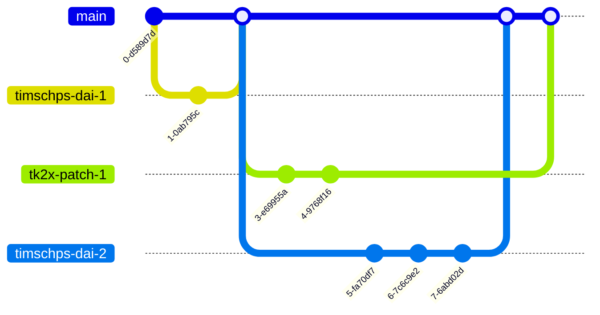

# How to contribute
Thank you for your interest in contributing to **Microsoft Tech Hub Netherlands**! 🙏 We greatly appreciate your time and effort in helping us improve and grow our project. This document provides guidelines and instructions to ensure that your contributions are valuable, effective, and aligned with our project's goals.

## Get started 🆕
We will be using **GitHub Codespaces** - a fully configured cloud-based development environment - which means that you _do not need_ to worry about setting up the work environment yourself. 

Just follow the steps provided below:

- Open the repository on GitHub
- Create a new branch
	> **Note:** we will explain later on how to create the branch
- Click on the green `Code` button on the top right of the page, as seen in the picture below:
- Then, select `Codespaces` .
- Initially, there should be no active codespace. We are going to create one now.
- Click on the `+` button in the codespaces.  This will create an environment for you which contains all the necessary dependencies/extensions etc., so you do not need to install anything else yourself!
- _Please wait for a couple of minutes for the codespace to be initialized!_
- Then, the codespace will launch in your browser tab. This will be your work environment.
- Now you are ready to create or modify content. See the next section for more information on that.
- > **Note:** that section needs to be added
- _After_ you are done with editing, you will need to commit to your branch. See the corresponding section for that.
	> **Note:** that section needs to be added

## Creating or modifying content 📝
### Site Structure
In the content folder in the root of the repo, you'll find a folder per workload. Each of those folders can contain one or more journeys. These can contain content to facilitate the documentation of that given partner journey. 
### Page structure
Each page has a specific structure. This structure is divided into frontmatter anx content: 

1. The **frontmatter** is a piece of metadata that is used by hugo to generate the page. It contains properties such as title, author (if provided) and the weight (which is used to order the pages in the menu).
2. After the frontmatter section, you can start writing the **content** of the page. The content is written in markdown. (The basic syntax can be found [here](https://www.markdownguide.org/basic-syntax/)) (Learning more about Markdown can be done [here](https://www.markdownguide.org/getting-started/))

```
---
title: -> The title of your page
weight: 99 # Where this page should be placed in the menu, compared to the other pages
chapter: false # don't worry about this one
date: 2023-02-23 
draft: true # Determines whether this page should be publicly available (or not) after doing the pull request in github
alwaysopen: false # don't worry about this one either, it's for the menu build up
---
some contents
## a header

### a subheader 
some more content

```
### Snippets (small peaces of text to speed up the writing process)

Hitting `Control`+`Space` on your keyboard will open a list of snippets that you can use to speed up the writing process. VsCode alreay provides you with a nice list, but we also added a few. Make sure to check it out

> the file that stores the definition of these snippets, can be found here: `.vscode/snippets.code-snippets

Below, you can find a quick summary:

| Snippet     | Description                                                                                                         |
| ----------- | ------------------------------------------------------------------------------------------------------------------- |
| FrontMatter | If you are starting of from a blank markdown document/page, then this snippet will help you with the basic metadata |
| Notice      | This snippet will help you with the creation of a notice (info, warning, etc.). A notice is basically a box with a title and content.| 
| Button      | Creates a button, multiple styles are possible |
| Tables | A few tables (2,3 - column tables) |
| Image | Creates an image, with title

### Guidelines & Best practices
### confidentiality

1. The idea really is to maximize the use of public (Microsoft related) information that is publicly available at various places and make it easy for our partners to find (and work with) that information.
2. We do not intend to upload any content that is not publicly available as this would be a breach in confidentiality.
3. (1) and (2) can be achieved by linking to existing (public) content. So, when that content
   1. **Evolves**: Then we don't have to do anything, as the link will still point to the latest version
   2. **Gets removed**: We have implemented dead link checking as part of our deployment process. This means that we will be notified when a link is broken (because the content is gone) and then we can take action to fix it.

### Accessibility
In terms of accessibility, there is a regular scan executed by the web compliance team. This scan reveals anything that might hinder accessibility. BeLux team has invested some time to get the scan in the green and would love if we can keep it that way (not for the sake of the metric, but to facilitate the partners that use the site). To achieve this, we will use the [Web Content Accessibility Guidelines (WCAG) 2.0](https://www.w3.org/TR/WCAG20/) as a guideline to make sure that the content of this website is accessible to everyone. 

Some areas where changes need to be made!
1. **Images**: Add alt text to all images (This is a requirement for the scan to pass).
   1. In essence, this means that we need to keep doing this in the future. 
2. **Color contrast**: look into changes regarding the color contrast.

## Commiting (a.k.a. saving your work) 💾
We will work with *pull requests* to get your changes into the published site. It offers a validation mechanism to protect the published result and to make sure a "quality assessment" of some sort can be guaranteed (where we protect each other from publishing incorrect/confidential/bad content). 

This is the procedure:

1. Commit your changes to your branch. (Since we started by creating a branch and opened a workspace from this point, the following will be fairly easy)
2. Push your changes to your branch.
3. When all the changes are committed and pushed, you can start a pull request. (this is done in the GitHub UI)
   1. Go to the GitHub UI and select your branch (you can do this by clicking on the branch name in the top left corner of the window)
   2. Click on the `Pull Request` button (top right corner of the window)
   3. Fill in the details of the pull request (title, description, etc.)
   4. Click on the `Create Pull Request` button

In summary, the "development" process would look like this:


The result is that we can all work on the same content, without blocking each other and on the same time protect the published result.