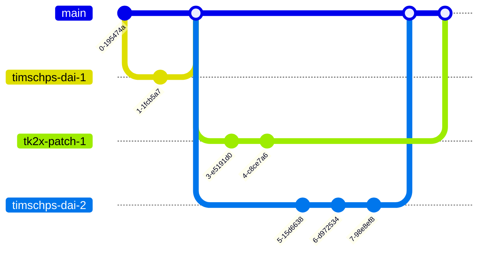

# Hello Team, Dear Contributor!

## What is the purpose of this repository?

We (the BeLux GPS TechTeam) get a lot of recurring questions from partners. Those questions typically are about to find specific information (technical mostly, but also linked to some programmatic aspects). They ask those questions because (1) they do not find what they need in the big amount resources that we offer, (2) because they need specific insights that we can offer. These questions are asked again and again and this means that we have to invest a lot of time to answer and bundle the information in those questions. 

 
Being fans of efficiency (and big impact), we are not too happy with this situation as this takes away a lot of our time, time which we otherwise could have used for other work...  It is for this reason that we have been exploring a way to help our partners to find the information that they need (repetitive work) and provide them with the insights that they are looking for. We came up with a solution that works well in our team context where we can publish this information in a consolidated way. On top of that, the setup that we envision, fits well with how we work (as the BeLux TechTeam) with our partners. The result is a (small) website, which we will host on GitHub pages, which we (the TechTeam) can use to leverage the knowledge & insights we have, to support our partners even better

## How can you contribute?

Starting is easy, just follow the below procedure to get your environment ready. After that, take a look at the [**Creating content**](#creating-content) section, where we give an overview of the tools that we have to help you get started in no time. 
### Getting started

Getting started is easy. We're working with GitHub Codespaces and that means that you only need to complete a few (very simple) steps to get started:

1. install VS Code 
2. Open the repo on GitHub <https://aka.ms/beluxpttrepo>
   1. Create a new branch (so that you can isolate your changes. this will also facilitate the pull request process)
   2. Activate the branch (so that you can start working on it)
   3. In the top right-ish corner of the window. There is a green "code" button. Click on that button and then take a **PAUSE**.
      1. you can clone the repo and start working, but it's a lot easier to work with codespaces :),
      2. Therefore, click on the tab `codespaces` (after having clicked the Green `code`button). 
      3. There you'll get an overview of existing codespaces (should be empty the first time), click on the first `+`-sign.
         1. This will create a fully functional codespace for you. (you can see it as a fully functional dev environment in the cloud) This codespace already contains everything you need to get started. (hugo, the correct extensions, the contents of our site, etc.)
         2. the startup (first time) will take a minute or 2 after which you can start creating content. 
         3. you'll see that the codespace is actually opened in the browser. (where all your changes will be persisted in the machine that is running the codespace)
         4. if you prefer working on your local machine, then all you need to do is "Click the codespaces button in the bottom left corner of the window and select Open in Visual Studio Code. This will open the codespace in a new window in Visual Studio Code on your local machine."
3. Create/Modify/Delete the content that you want to change. (More info on that can be found in the ["Creating content"](#creating-content) section)
4. When you are ready with your changes, you need to commit them to your branch. (you can do this in the codespace, or in VS Code on your local machine) and then start a pull request. (this is described in the next section). 


### Committing -> Pull Request

We will work with pull requests to get your changes into the published site. The reason is simple: All teams in microsoft working on docs/code use this approach. It offers a validation mechanism to protect the published result and to make sure a "quality assessment" of sorts can be guaranteed (where we protect each other from publishing incorrect/confidential/bad content). 

This is the procedure:

1. Commit your changes to your branch. (Since we started by creating a branch and opened a workspace from this point, the following will be fairly easy)
2. Push your changes to your branch.
3. When all the changes are committed and pushed, you can start a pull request. (this is done in the GitHub UI)
   1. Go to the GitHub UI and select your branch (you can do this by clicking on the branch name in the top left corner of the window)
   2. Click on the `Pull Request` button (top right corner of the window)
   3. Fill in the details of the pull request (title, description, etc.)
   4. Click on the `Create Pull Request` button

In summary, the "development" process would look like this:



The result is that we can all work on the same content, without blocking each other and on the same time protect the published result.

## Creating content
### Site Structure
In the content folder in the root of the repo, you'll find a folder per workload. Each of those folders can contain one or more journeys. These can contain content to facilitate the documentation of that given partner journey. 


### Page structure

Each page has a specific structure. This structure is divided into frontmatter anx content: 

1. The **frontmatter** is a piece of metadata that is used by hugo to generate the page. It contains properties such as title, author (if provided) and the weight (which is used to order the pages in the menu).
2. After the frontmatter section, you can start writing the **content** of the page. The content is written in markdown. (The basic syntax can be found [here](https://www.markdownguide.org/basic-syntax/)) (Learning more about Markdown can be done [here](https://www.markdownguide.org/getting-started/))

```
---
title: -> The title of your page
weight: 99 # Where this page should be placed in the menu, compared to the other pages
chapter: false # don't worry about this one
date: 2023-02-23 
draft: true # Determines whether this page should be publicly available (or not) after doing the pull request in github
alwaysopen: false # don't worry about this one either, it's for the menu build up
---
some contents
## a header

### a subheader 
some more content

```


### Snippets (small peaces of text to speed up the writing process)

Hitting `Control`+`Space` on your keyboard will open a list of snippets that you can use to speed up the writing process. VsCode alreay provides you with a nice list, but we also added a few. Make sure to check it out

> the file that stores the definition of these snippets, can be found here: `.vscode/snippets.code-snippets

Below, you can find a quick summary:

| Snippet     | Description                                                                                                         |
| ----------- | ------------------------------------------------------------------------------------------------------------------- |
| FrontMatter | If you are starting of from a blank markdown document/page, then this snippet will help you with the basic metadata |
| Notice      | This snippet will help you with the creation of a notice (info, warning, etc.). A notice is basically a box with a title and content.| 
| Button      | Creates a button, multiple styles are possible |
| Tables | A few tables (2,3 - column tables) |
| Image | Creates an image, with title|

## Guidelines, Agreements & Best Practices

### confidentiality

1. The idea really is to maximize the use of public (Microsoft related) information that is publicly available at various places and make it easy for our partners to find (and work with) that information.
2. We do not intend to upload any content that is not publicly available as this would be a breach in confidentiality.
3. (1) and (2) can be achieved by linking to existing (public) content. So, when that content
   1. **Evolves**: Then we don't have to do anything, as the link will still point to the latest version
   2. **Gets removed**: We have implemented dead link checking as part of our deployment process. This means that we will be notified when a link is broken (because the content is gone) and then we can take action to fix it.

### Accessibility

In terms of accessibility, there is a regular scan executed by the web compliance team. This scan reveals anything that might hinder accessibility. We've invested some time to get the scan in the green and would love if we cn keep it that way. (not for the sake of the metric, but to facilitate the partners that use the site). To achieve this, we will use the [Web Content Accessibility Guidelines (WCAG) 2.0](https://www.w3.org/TR/WCAG20/) as a guideline to make sure that the content of this website is accessible to everyone. 

Some area's where we had to apply changes:

1. **Images**: We've added alt text to all images. (this is a requirement for the scan to pass)
   1. In essence, this means that we need to keep doing this in the future. 
2. **Color contrast**: we made changes to the contrast the used colors.
3. ...


